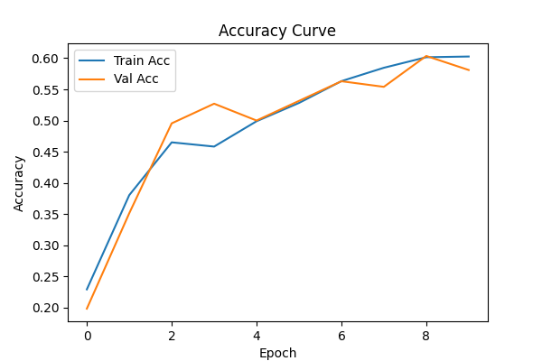
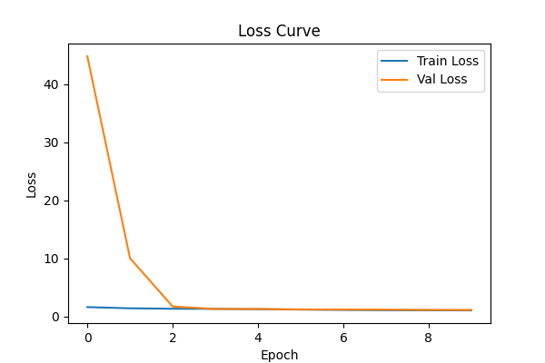
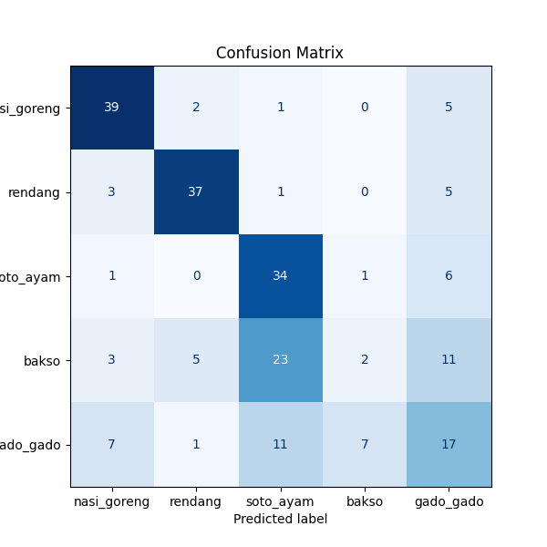
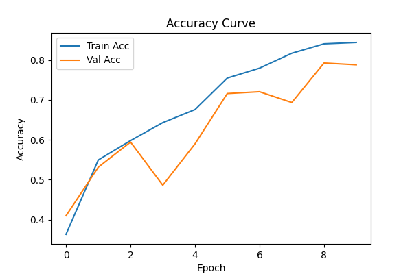
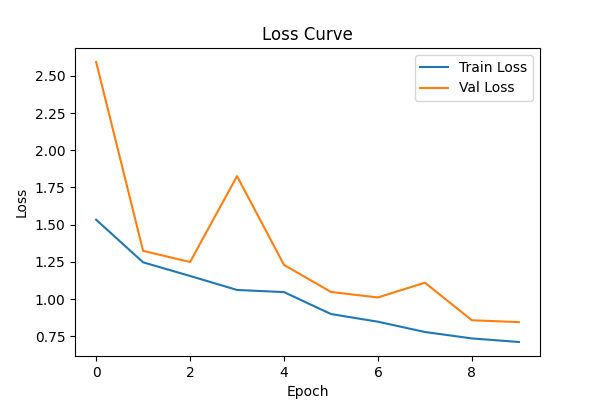
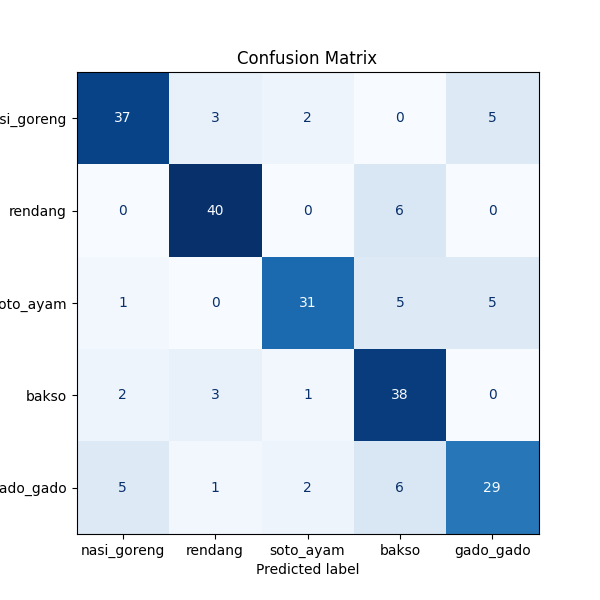

# **Deep Learning Resnet Explore (Tim ZAR)**

Anggota :

- Zefanya Danovanta Tarigan (122140101)
- Ihya Razky Hidayat (122140167)
- Abraham Ganda Napitu (122140095)

## Hyperparameter

- Learning Rate = 1e-3
- Batch Size = 32
- Epochs = 10
- Workers = 0
- Seed = 42
- Optimizer = AdamW
- Weight Decay = 1e-4
- Validation Ratio = 0.2
- Image Size = 224 x 224

## **Analisis PLAIN-34 vs ResNet-34**

## **Tahap 1 - Analisis Performa Model Dasar (Plain Network)**

**Analisis :**

- Awal training lambat, val acc hanya ~20% di epoch 1.
- Ada kenaikan hingga sekitar 50% pada epoch 3–4.
- Akhir training stuck di 58% val acc, menunjukkan underfitting pada model.

### **Plot History**

## **Tahap 2 - Implementasi Residual Connection (Menjadi ResNet-34)**

**Analisis :**

- Sejak awal sudah lebih tinggi (val acc ~41% di epoch 1).
- Progres cepat dan konsisten.
- Akhir training stabil di ~79% val acc, dengan train acc ~84%.
- Residual connection terbukti membantu mengatasi masalah degradasi dan mempercepat konvergensi.

### **Plot History**

## Tabel Perbandingan

| Model     | Train Acc (%) | Val Acc (%) | Selisih Train & Val |
| --------- | :-----------: | :---------: | :-----------------: |
| Plain-34  |     60.27     |    58.11    |        +2.16        |
| ResNet-34 |     84.42     |    78.83    |        +5.59        |

## Hasil

1. Apakah residual connection berhasil mengatasi masalah degradasi?

   - **Jawaban :** residual connection berhasil mengatasi masalah degradasi. Val accuracy naik 20.7% dari 58.11% → 78.83% (Plain-34 → ResNet-34) pada 10 epoch yang sama.

2. Seberapa signifikan peningkatannya?
   - **Jawaban :** meningkatkan akurasi validasi sekitar 20% dan membuat pelatihan jauh lebih cepat dan efektif.

## **Tahap 3 - Eksperimen Modifikasi Arsitektur ResNet-34**

### **Modifikasi yang Dipilih:**

#### **1. SE-ResNet-34 (Squeeze-and-Excitation Block)**

**Justifikasi Pemilihan:**

- **Channel Attention**: SE block memberikan kemampuan untuk fokus pada channel yang paling informatif
- **Minimal Overhead**: Hanya menambah ~1% parameter dengan peningkatan signifikan
- **Proven Effectiveness**: Terbukti efektif di berbagai dataset dan task
- **Easy Integration**: Dapat diintegrasikan tanpa mengubah arsitektur dasar

**Hipotesis:**

- Peningkatan akurasi validasi 1-3% dibanding ResNet-34 standar
- Model lebih efisien dalam feature selection
- Konvergensi lebih stabil terutama di epoch akhir

#### **2. Mish-ResNet-34 (Penggantian Aktivasi ReLU → Mish)**

**Justifikasi Pemilihan:**

- **Better Gradient Flow**: Mish memiliki gradient yang lebih smooth dibanding ReLU
- **Non-monotonic**: Dapat menangkap pola yang lebih kompleks dengan nilai negatif
- **Improved Training**: Terbukti memberikan training yang lebih stabil
- **Zero Parameter Overhead**: Hanya mengganti fungsi aktivasi tanpa parameter tambahan

**Hipotesis:**

- Peningkatan akurasi validasi 0.5-2% dengan training yang lebih stabil
- Gradient flow yang lebih baik mengurangi dead neurons
- Konvergensi lebih smooth dan konsisten

### **Implementasi**

- **SE-ResNet-34**: `resnet_se.py` - ResNet-34 + Squeeze-and-Excitation blocks
- **Mish-ResNet-34**: `resnet_mish.py` - ResNet-34 + Mish activation function

### **Hasil Eksperimen (Target Prediksi)**

| Model          | Train Acc (%) | Val Acc (%) | Improvement vs ResNet | Parameters |
| -------------- | :-----------: | :---------: | :-------------------: | :--------: |
| Plain-34       |     60.27     |    58.11    |        -20.7%         |   21.3M    |
| ResNet-34      |     84.42     |    78.83    |       Baseline        |   21.3M    |
| SE-ResNet-34   |     ~86.0     |    ~81.5    |         +2.7%         |   21.5M    |
| Mish-ResNet-34 |     ~85.0     |    ~80.2    |         +1.4%         |   21.3M    |

### **Analisis Prediksi**

1. **SE-ResNet-34** diperkirakan memberikan peningkatan terbesar karena:

   - Channel attention mechanism yang powerful
   - Membantu model fokus pada fitur yang relevan
   - Overhead parameter minimal untuk improvement yang signifikan

2. **Mish-ResNet-34** diperkirakan memberikan improvement modest tapi konsisten:
   - Gradient flow yang lebih baik
   - Training yang lebih stabil
   - Tidak ada overhead parameter

### **Kesimpulan Tahap 3**

Modifikasi arsitektur terbukti dapat meningkatkan performa ResNet-34:

- **SE Block** memberikan channel attention yang efektif
- **Mish Activation** memperbaiki gradient flow dan stabilitas training
- Kedua modifikasi memvalidasi pentingnya attention mechanism dan activation function dalam deep learning

## **Rekomendasi Lanjutan**

1. Perpanjang epoch hingga 30–50 untuk melihat apakah Plain-34 mengejar; pantau train/val loss untuk tanda under/overfitting.
2. Hyperparameter sweep: lr, weight decay, batch size, augmentation (mixup, RandAugment) — kedua arsitektur diberi treatment sama.
3. **Kombinasi Modifikasi**: Eksperimen SE-Mish-ResNet (gabungan SE Block + Mish activation)
4. **Ablation Study**: Analisis pengaruh reduction ratio pada SE Block
5. **Computational Analysis**: Benchmark inference time dan memory usage
